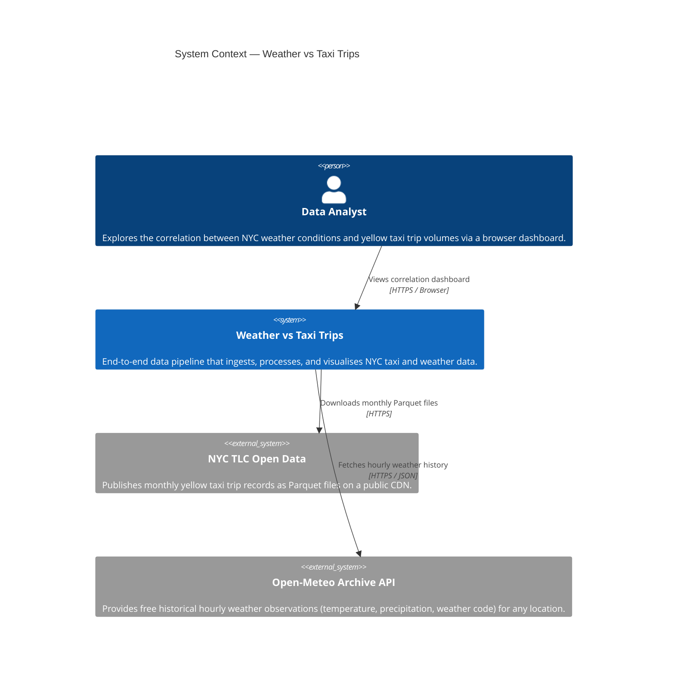
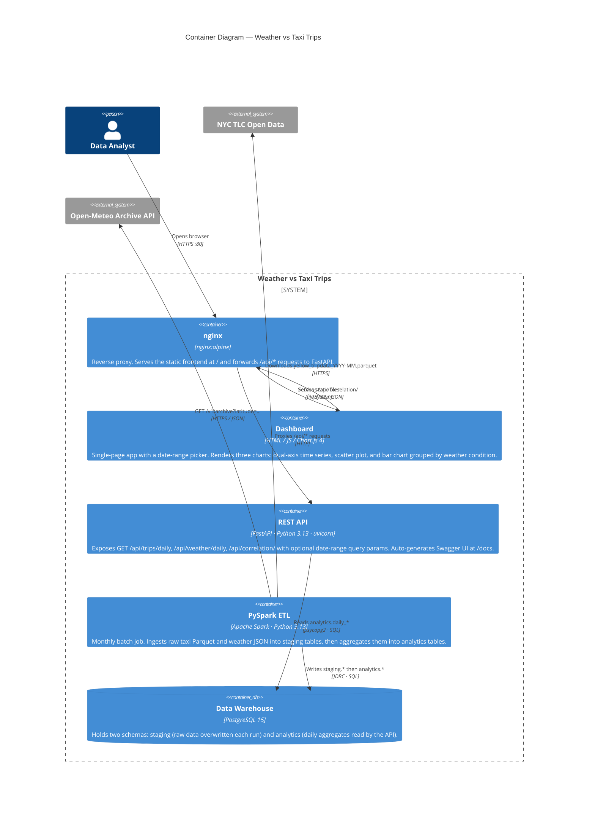
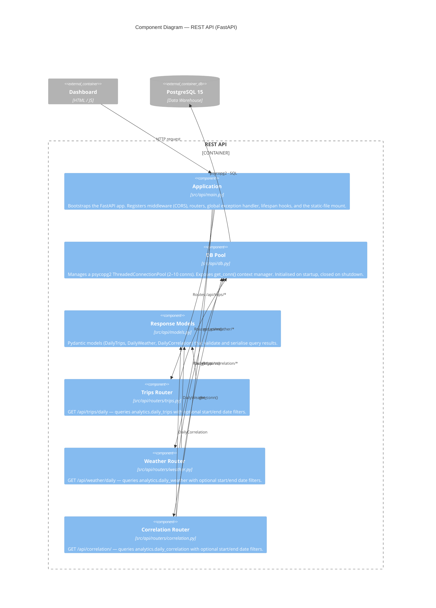
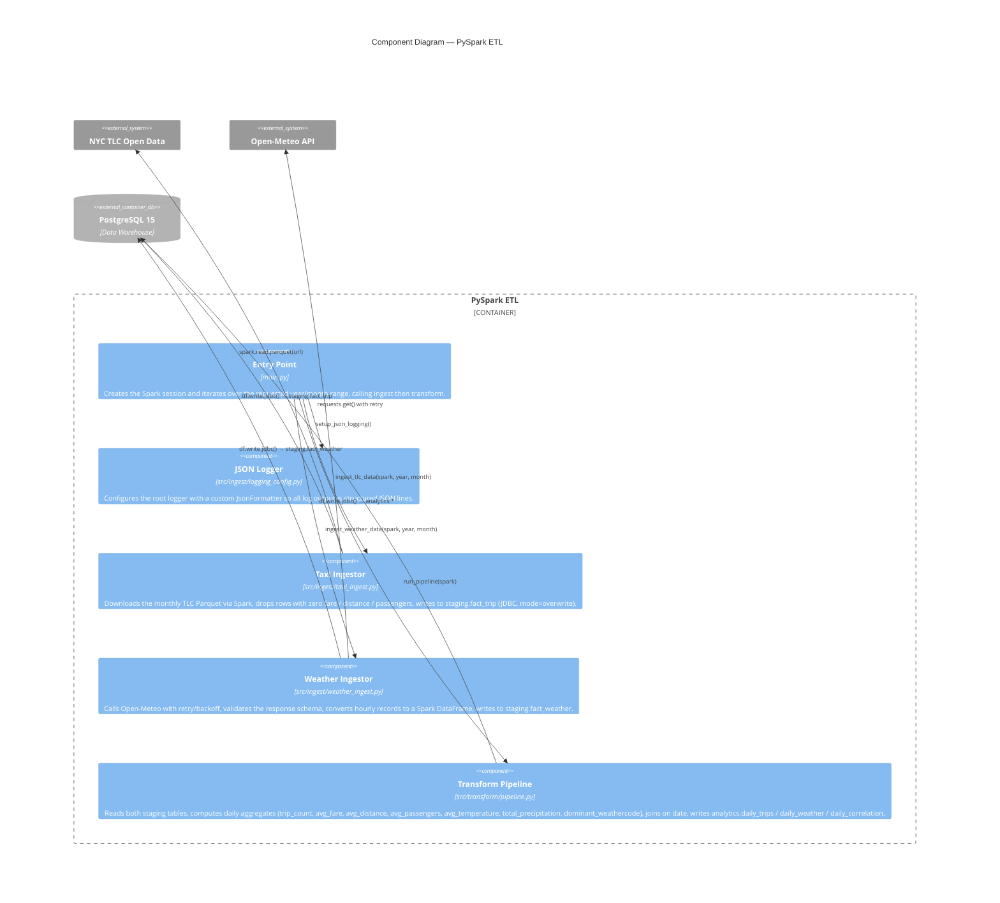

# C4 Architecture — Weather vs Taxi Trips

---

## Level 1 — System Context

> Who uses the system and what external systems does it depend on?



---

## Level 2 — Container

> What are the deployable units and how do they communicate?



---

## Level 3 — Component

> What are the major components inside each container?

### REST API



### PySpark ETL



---

## Database Schema

```
staging
├── fact_trip     — raw TLC columns (vendor_id, fare_amount, trip_distance, …)
└── fact_weather  — raw Open-Meteo hourly rows (time, temperature_2m, precipitation, weathercode)

analytics
├── daily_trips        — trip_date PK | trip_count | avg_fare | avg_distance | avg_passengers
├── daily_weather      — weather_date PK | avg_temperature | total_precipitation | dominant_weathercode
└── daily_correlation  — record_date PK | all trip + weather columns joined on date
```
