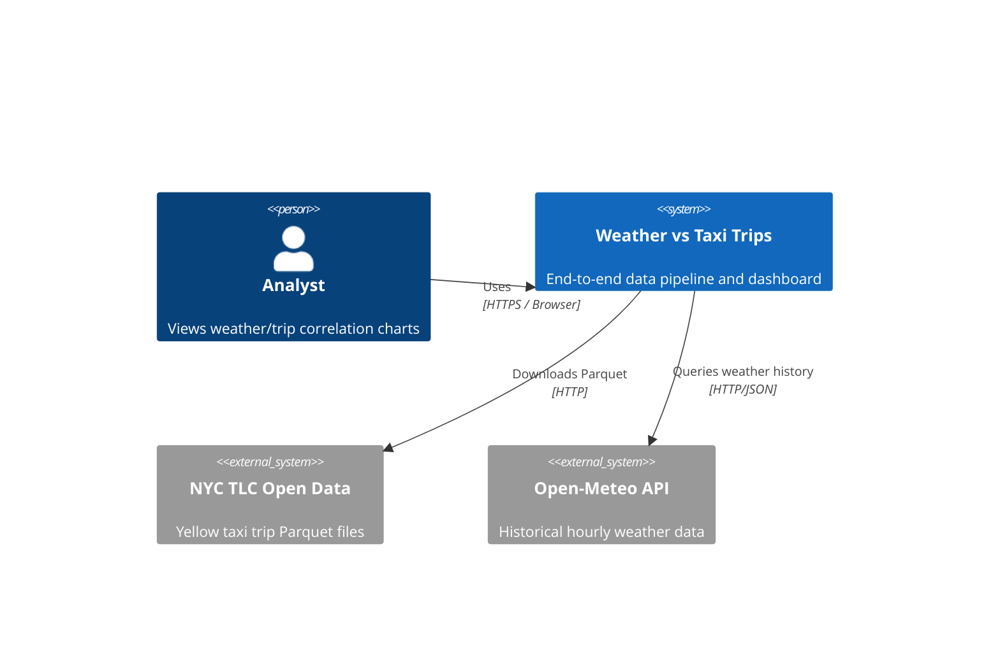
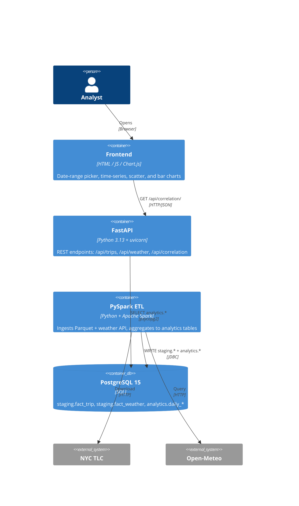

# Architecture Diagrams

## C4 Context

```mermaid
C4Context
    Person(analyst, "Analyst", "Views weather/trip correlation charts")
    System(system, "Weather vs Taxi Trips", "End-to-end data pipeline and dashboard")
    System_Ext(tlc, "NYC TLC Open Data", "Yellow taxi trip Parquet files")
    System_Ext(meteo, "Open-Meteo API", "Historical hourly weather data")

    Rel(analyst, system, "Uses", "HTTPS / Browser")
    Rel(system, tlc, "Downloads Parquet", "HTTP")
    Rel(system, meteo, "Queries weather history", "HTTP/JSON")
```

## C4 Container

```mermaid
C4Container
    Person(analyst, "Analyst")

    Container(frontend, "Frontend", "HTML / JS / Chart.js", "Date-range picker, time-series, scatter, and bar charts")
    Container(api, "FastAPI", "Python 3.13 + uvicorn", "REST endpoints: /api/trips, /api/weather, /api/correlation")
    Container(etl, "PySpark ETL", "Python + Apache Spark", "Ingests Parquet + weather API, aggregates to analytics tables")
    ContainerDb(db, "PostgreSQL 15", "SQL", "staging.fact_trip, staging.fact_weather, analytics.daily_*")

    System_Ext(tlc, "NYC TLC")
    System_Ext(meteo, "Open-Meteo")

    Rel(analyst, frontend, "Opens", "Browser")
    Rel(frontend, api, "GET /api/correlation/", "HTTP/JSON")
    Rel(api, db, "SELECT analytics.*", "psycopg2")
    Rel(etl, db, "WRITE staging.* + analytics.*", "JDBC")
    Rel(etl, tlc, "Download", "HTTP")
    Rel(etl, meteo, "Query", "HTTP")
```
